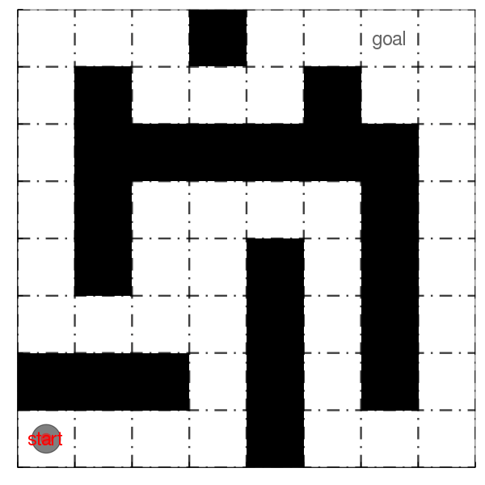
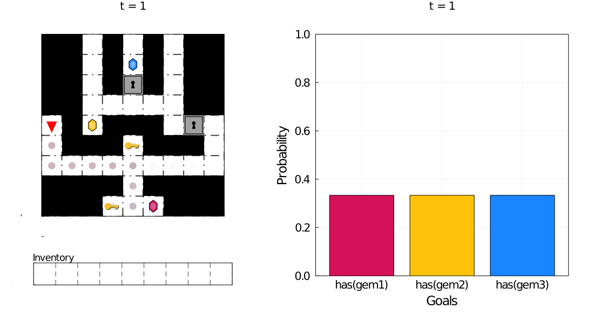
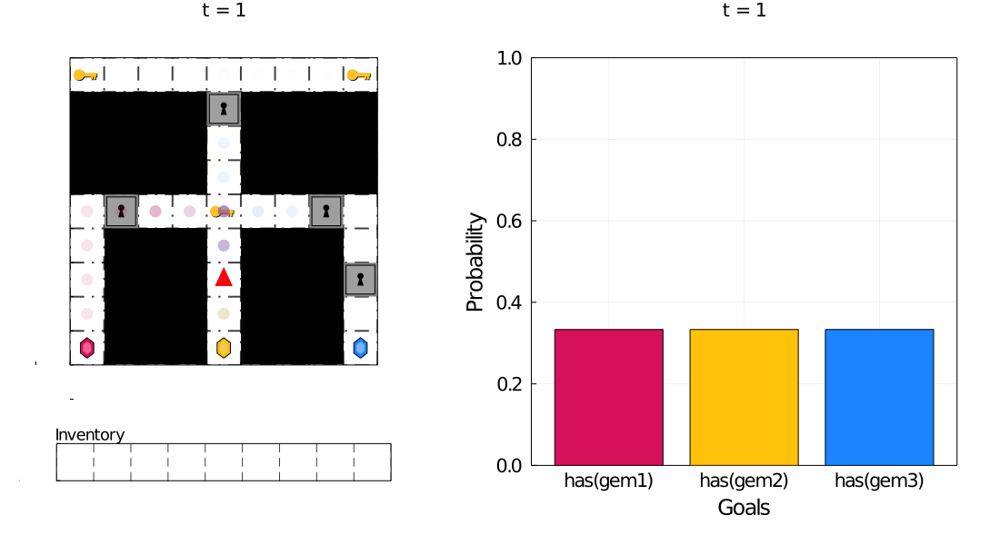
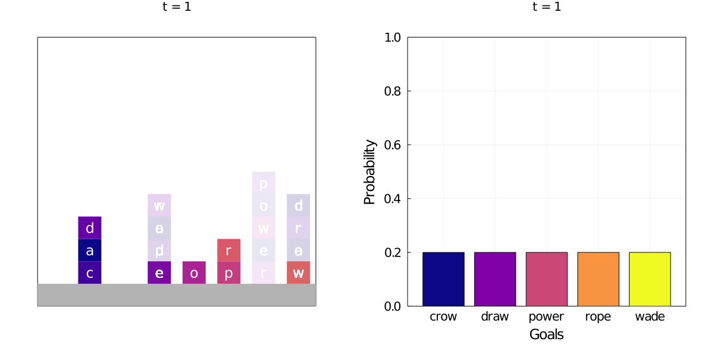

# Plinf.jl

An architecture for planning, inverse planning, and inference in planning,
using [PDDL](https://github.com/ztangent/PDDL.jl) and [Gen](https://www.gen.dev/).

## Setup

To use this library in your own projects, press `]` at the Julia REPL to
enter the package manager, then run:
```julia
add https://github.com/ztangent/Plinf.jl.git
```

To explore the examples provided in this repository, clone this repository,
press `]` at the Julia REPL to enter the package manager, then run `activate .`
and `instantiate` to install all necessary dependencies.

## Examples

Plinf.jl can be used to model agents that perform model-based heuristic search
to achieve their goals. Below, we visualize a sampled trace for a replanning
agent that interleaves resource-bounded plan search with plan execution:



We can then perform goal inference for these agents:



Notice that the correct goal is eventually inferred, despite backtracking
by the agent. This is because we model the agent as *boundedly rational*:
it does not always produce optimal plans. Indeed, this modeling assumption
also allows us to infer goals from *failed plans*:



Because we use the Planning Domain Definition Language (PDDL) as our underlying
state representation, our architecture supports a large range of domains,
including the classic Blocks World:



For more details about the modeling and inference architecture,
consult our paper:

T. Zhi-Xuan, J. L. Mann, T. Silver, J. B. Tenenbaum, and V. K. Mansinghka,
[“Online Bayesian Goal Inference for Boundedly-Rational Planning Agents,”](http://arxiv.org/abs/2006.07532) arXiv:2006.07532 [cs], Jun. 2020.

Full example code for several domains can be found here:
[Gridworld](domains/gridworld/example.jl);
[Doors, Keys & Gems](domains/doors-keys-gems/example.jl);
[Block Words](domains/block-words/example.jl)
